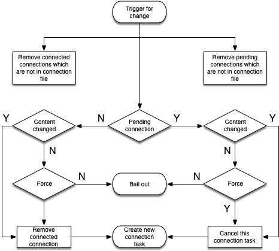

# Auto connect
The auto connection functionality allows you to control connections configurations solely through a file.
Such a feature is handy when deploying ck in a autonomous setup within for example Kubernetes or DockerSwarm. In Kubernetes for example, you can re-configure, enable or disable connections with a ConfigMap.


## The basic functionality summarized:
1. At conkolla start time the flag `--connectionsFile <file.yml>` must be given. 
2. Conkolla reads the file, and for every specified connection it starts a auto-connector.
3. The auto-connector creates a connection according to the given spec.

## connectionsFile
### Format
The format used is yaml. A bare minimal file with no connection data must have the following field:
```
---
version: 1

```
The version has almost no semantic in conkolla, it is intentioned for the operator. However, if the value is changed, a running auto-connector will trigger an update event which, depending on your
settings might change your connections.

You can launch conkolla with this bare file. Later, you will then not need to re-start conkolla if you want to add connections.


### Connection fields
The `connectionsFile` uses the same fields as the conkolla API to login. You can retrieve a list by:

```
curl -k -H "Accept: application/json" https://localhost:4433/login/|jq
```

### Example of a connection file:

```
---
version: 1
connections:
- controllerURL: skip.packnot.com
  controllerPort: 8443
  username: apiuser
  azureVault: true
  azureVaultName: ops-secrets
  azureSecretName: skip-packnot-metrics
  label: collector1
  skipVerifySSL: true
  autoTokenRenewal: true
  promCollector: true
  autoConnectForce: false
```
#### autoConnectForce
The field controls whether a connections is always re-newed (`true`) or not (`false`) if auto connector detects a file change. For example you might want to do so if the verision number changes, 
but content is not changed for that connection. You probably won't need it.

### autoTokenRenewal
Useful to let conkolla renew automatically tokens if they expire. If you want to run it autonomous, you will set this to true.

### Connection identifier
As with all connections in conkolla, a connection is made unique with a key composed as the concatenation of the fields: `controllerURL` and `label`. If a connection with the key exists it will reject it.
If you change for a pending or established connection one of these fields, the connection respective the task will be removed and a new task created.

### Connection control
Auto connections are solely controlled through the file. Trying to modify or delete an auto-connected connection with the conkolla API (or UI) will not work. However you can revoke tokens or renew tokens if it has `autoTokenRenewal` set.

### Auto connectors work flow
Once auto-connector has started a connection task, it will try connecting forever, until it succeeds a login or the task is removed. Tasks which are trying to connect are called pending connections. 
Pending connections can be canceled by deleting the connection from the connectionsFile.

Whenever there is change in the file, the auto-connector will handle the specification accordingly:


 A change can be triggered by two things:
 1. `Version` field value change
 2. Specification of at least one connection specs changes


## Secrets in the connectionsFile
The `connectionsFile` will reference some sort of secret aka Username and Password. `ConnectionsFile` is most securely used when combining it with AWS KMS (use IP filtering or assumed role) or AZ-Keyvault (use of managed identify). For more information regarding KMS and KV see the dedicated page on [security](./security.md).


