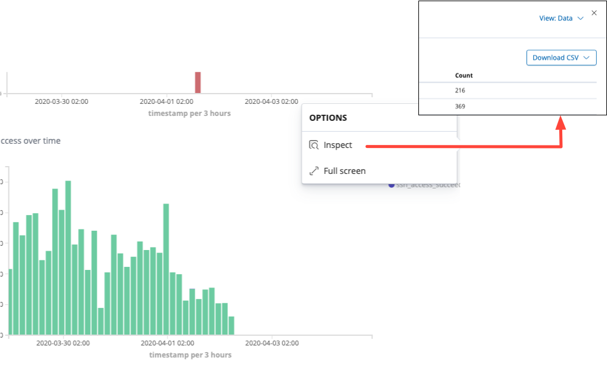

# Reporting, exporting CSV & Co

Note:
- the API is administrative and informative. It also exposes states on the requested context.
- the API does not do query against logserver or the events stored in the logserver.

## Use conkolla to export or report on API calls
You can use conkolla to export the responses from any API call. You can either downlod it as:
- JSON
- CSV

CSV will flatten the JSON by one level only.

You can for example use it to report on licenses used, active sessions or any other information of interest. Other information, such as the "stats" page can also be fetched as CSV data.

## Howto:
1. Download [Conkolla latest release](https://github.com/appgate/conkolla/releases/latest) 
1. Launch it (Windows in this example): `Conkolla.exe --authName <a username> --authPassword <a password>`
1. Open chrome browser and go to [https://localhost:4433](https://localhost:4433)
1. Log into your controller by clicking on the **+** next to _connected controllers_. Assure you login with an admin user.
1. When succesfully logged in, click on "Start making rest calls by clicking here".
1. In the form type the API path you want to make a call for, example `/stats/active-sessions`, and click on GET.
1. The result is presented in the below ace editor.
1. Save the content as CSV by clicking the button `save csv`

for more options and information of usage see the [documentation](./README.md).

## CSV download data from Kibana/logserver
The API gives you configuration and state information. The logserver records events. It is a database of events throughout the system arrived at arbitrary times. In an industrial installation you will most commonly encounter a log aggregator and SIEM where you will be able to create reports and data of events rather in the on-board logserver.

It is common for AppGate Admininistrators to have either syslog data or the on-board Kibana data available for troubleshooting and deployement verification, specially in small installations you will find the on-board logserver (Kibana, elastic search etc.) in use. 

The on-board Kibana is the `open source`, a free of charge, version which does not come with a reporting and exporting feature. The reporting feature appears first in the `Basic` Kibana (elastic search) version, which contains the X-Pack for which the company elastic search cannot claim to be open source and hence the exclution in the free version.

You can **download CSV** from Kibana by creating a `visualization` of the data in question, and can use the `inspect` option, accessing it by clicking on the three dots °°°. See the example from a visualization added to a dashboard:

