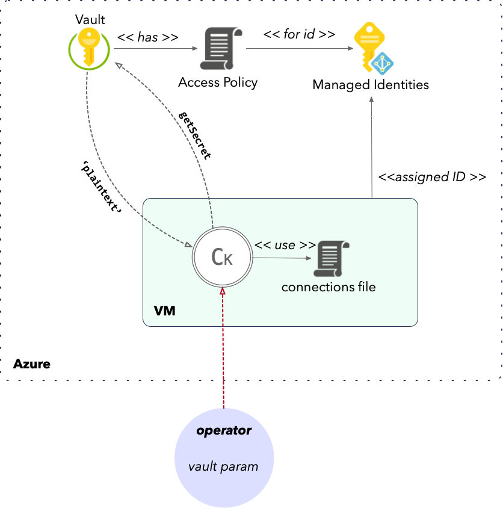

# AppGate password handling
The password is a secret and needs proper protection. Conkolla provides different methods and handlers to deal with the security of.

## Overview
- The password is only used by conkolla while logging in a connection and exists only in memory. After the login the plain-text password is deleted.
- Using azure vault does always get the password from the vault. You will *not* need to provide the password to conkolla in any form. It will never store it locally.
- If you use `autoTokenRenewal`...
	- and use KMS or local secret handler (default is local):
		- The password is handled and stored in memory according to the secrets handler locally.
	- or use azure vault:
		- The password is always fetched from the vault when needed and never stored locally.

## Secret handlers
Secret handlers have been implemented to create an appropriate level of security around the password used for a connection to login. It is however the operators responsibility to configure the appropriate handler in conkolla, and follow the principle of least privileges when creating API users in AppGate.
The handler is configured during the connection setup aka login. The operator will be setting these through a combination with/or 
- username , password
- parameters to configure the handler

The secrets handler has basically two functionalities:
1. Get or decrypt a secret to be used as the password during login
2. Encrypt password when `autoTokenRenewal` is used. This applies only to KMS and local handler.


### Local secrets handling
Auto-token renewal has until version 7 only been possible due to  a *built in kms* (referred as local), which did the encryption and decryption of the API user's password:
 - Encrypts password/secrets using 256-bit AES-GCM.  
 - This both hides the content of the password and provides a check that it hasn't been altered.
 
 

 You can either login a connection from file or via REST/form. The plain-text password however will be known to the operator and exposed in the connections file.


### KMS (external encryption/decryption provider)
Since version 7, support for key management service is available. Currently only AWS is supported. You can use KMS to:
1. login with a aws kms blob as the password (base64 encoded)
1. use kms for password encryption when using auto-renewal

In the second case, the password is encrypted by the  KMS and the cipher blob stored in memory:
- During token renewal, the blob is decrypted and the password (plain text) is used to retrieve new token from AppGate. 
- After every renewal, if fail or succeeds, password is encrypted and stored again and the password is wiped.


You can login a connection from file or via REST/form. Using KMS you should avoid using any plain-text. If you use connections file with KMS, never use plain-text, always use the blob. An operator might use a plain-text password for login, which conkolla will encrypt with KMS for any future token renewal.

*Connections file example with blob*
```
version: 1
connections:

- controllerURL: merger.packnot.com 
  username: stats_user
  password: AQICAHg1y1adpOYadETsIj2dDXa5jJrN+bJWtGu3Q4GM9o5c+QGGH/Gf1eng50epoEMh3pqGAAAAZTBjBgkqhkiG9w0BBwagVjBUAgEAME8GCSqGSIb3DQEHATAeBglghkgBZQMEAS4wEQQMfUFJxInMFGkQscNOAgEQgCLk4WNrMENV50otKgrrNdaBLoeCTGeB0r5i3IS5zKoqlVFa
  kmsBlob: true
  kmsProvider: aws
  kmsKey: 157fa93e-ee11-1233-af2e-cc153d6595f7
  kmsRegion: eu-north-1
  skipVerifySSL: true
  apiVersion: 12
  autoTokenRenewal: true
```


Credentials for KMS is as to the [aws sdk-for-go](https://docs.aws.amazon.com/sdk-for-go/v1/developer-guide/configuring-sdk.html); from the section *Specifying Credentials*:

1. Environment variables.
2. Shared credentials file.
3. If your application is running on an Amazon EC2 instance, IAM role for Amazon EC2.
4. If your application uses an ECS task definition or RunTask API operation, IAM role for tasks

In the illustration we are using IAM role, which is the most recommended way.

See also the companion [kmstool cli](./kmstool.md)


### Azure Vault secret handler (new since v7.5)
The vault allows you to never disclose the password (or encrypted password) to the operations. Conkolla will use the `vault name` and the `secret name` to retrieve the password's plain-text from the vault. If `autoTokenRenewal` is used, it will simply use the vault parameters to retrieve the password during renewal. 




You can login a connection from file or via REST/form. You need only to specify the vault parameters. Example:

```
version: 1
connections:

- controllerURL: merger.packnot.com
  username: ent_creator
  azureVault: true
  azureVaultName: infra-int-devops
  azureSecretName: ag-merger-packnot-com  
  skipVerifySSL: true
  apiVersion: 12 
  autoTokenRenewal: true

```
Conkolla supports only `Azure Managed Identies` for this operation. The internal authorization process for conkolla against the vault relies on the assigned identity and is deduced from the cloud layer. To make this work, we require the following setup:
- A `user assigned identity` (under azure > managed identities)
- The VM on which conkolla runs has been assigned the `user assigned identity`. 
- The vault has a policy set to allow that identity `to get the secret`. 

